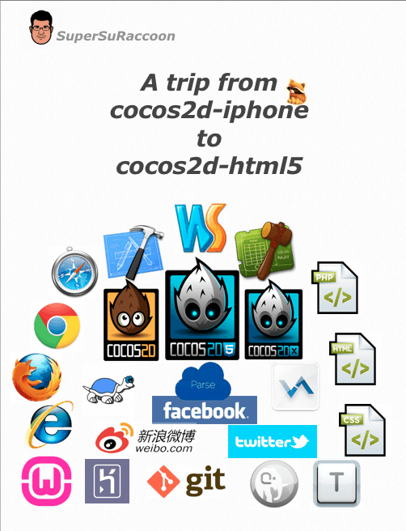
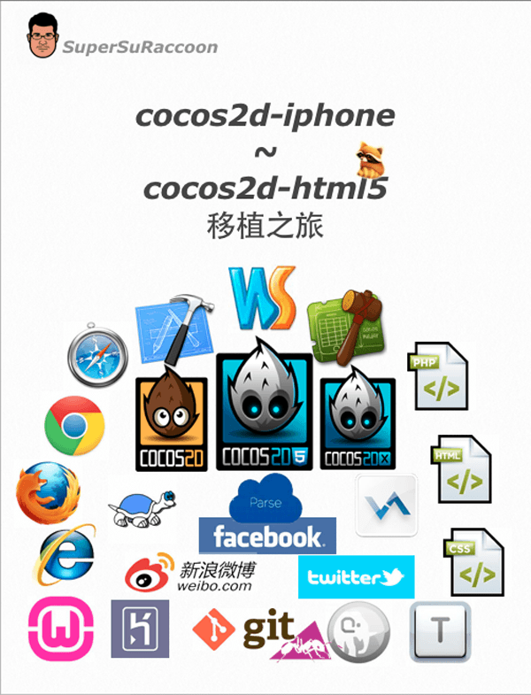

### A trip from cocos2d-iphone to cocos2d-html5

A published [book on iBookStore ](https://itunes.apple.com/us/book/trip-from-cocos2d-iphone-to/id633105012) recoding my learning experience from `cocos2d-iphone` to `cocos2d-html5`.

#### What's in the book

1.  The start - Porting an ios game to html5
    -   Introduction to cocos2d-html5
    -   Why html5 ?
    -   Why cocos2d-html5 ?
    -   Something about this book
2.  Tools and knowledge -A summary onwhat we need for each step
    -   A checklist of the what we need 
3.  Basic stuffs - Porting to cocos2d-html5
    -   Comparison between cocos2d-iphone against cocos2d-html5
    -   On porting CallFunc to cocos2d-html5
    -   On porting Array and Dictionary to cocos2dhtml5
4.  Special stuffs - Porting to cocos2d-html5
    -   On “function” in cocos2d-html5
    -   On Singleton in cocos2d-html5
    -   On Delegate in cocos2d-html5
    -   On Timer in cocos2d-html5
    -   On NSSelectorFromString in cocos2d-html5
    -   On block in cocos2d-html5
5.  Time for cocosbuilder -One tool two versions
    -   Introduction to cocosbuilder
    -   Comparison between cocos2d-iphone againstcocos2d-html5 using cocosbuilder 
6.  Watch out for traps -what we should notoverlook when using cocosbuilder
    -   All kinds of traps 
7.  cocosbuilder in-depth - MVC in cocos2dhtml5
    -   Watch out for the dynamic feature in javascript
    -   MVC (View) in cocosbuilder + cocos2d-html5
    -   MVC (Controller) in cocosbuilder + cocos2dhtml5 
8.  Play with cocos2d-html5 - Various IDE and debug tools
    -   IDE for development - Jetbrains WebStrom
    -   Setting up a local server
    -   Co-debug our game in LAN
    -   Quick debug - notepad + Google chrome
    -   Debug offline on ipad - textastic + firebug 
9.  Time for release -Pack your game with ant
    -   Using ant to pack your game
    -   Code modification 
10.  Play with the world - Using Parse forLeaderboard in cocos2d-html5
     -   Introduction to Parse
     -   Getting start with Parse
     -   Using Parse to load/save data
     -   On Querying and Sorting data
     -   Using anonymous function with asynchronousParse API 
11.  Welcome twitter -Using web intents totweet in game
     -   Introduction to twitter web intents
     -   The usage of twitter web intents 
12.  Welcome heroku - Prepare for Facebook release
     -   Introduction to heroku
     -   Installing heroku
     -   Using heroku with git command
     -   Deploying the game as php app 
13.  Welcome Facebook - Connect our game to Facebook
     -   Prepare for connecting with Facebook
     -   Authorization with Facebook
     -   Playing with Dialogs in Facebook
     -   Decorate our game page 
14.  Welcome SinaAppEngine -Prepare forSina Weibo release
     -   Introduction to Sina App Engine
     -   Sina App Engine code management
     -   Deploying the game as php app 
15.  Welcome Sina Weibo -Connect our game to Sina Weibo
     -   Prepare for connecting with Sina Weibo
     -   Authorization with Sina Weibo
     -   Playing with Weibo publisher 
16.  My site my game - Embedding the game into our site
     -   Embedding game in a post 
17.  The magic of HTML5 - Embedding the game into a book
     -   Changing our game to widget 
18.  The destination - Looking back the trip

And there is an old [post on my blog](http://www.supersuraccoon-cocos2d.com/2013/04/12/a-trip-from-cocos2d-iphone-to-cocos2d-html5/) about this game.

